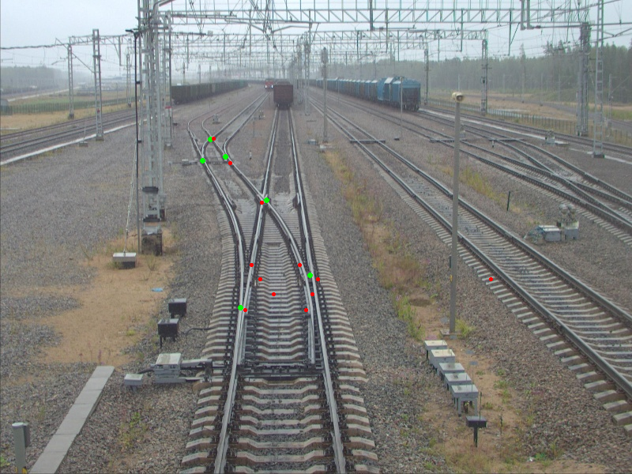

# Project for testing cross detector results  
input: path_to_images_dir, path_to_expected_res_dir, path_to_real_results_dir  
output: images on which green circles is expected results, and red circles is real results  
# How to run test  
main.py images expected results  
# Example output  

